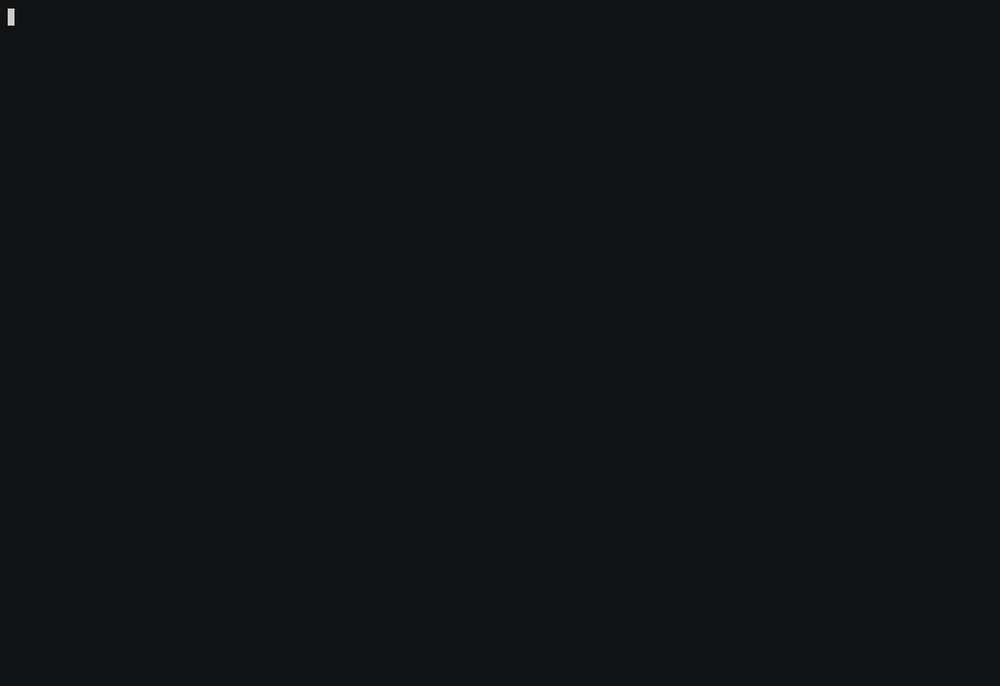

# Ankra CLI

A command-line interface for the [Ankra Platform](https://ankra.ai) that allows you to manage Kubernetes clusters, operations, stacks, manifests, addons - and tap into platform-wide insights.

Declare a cluster's platform in one file, apply it, and watch it converge:



When something is wrong, the same CLI reads the live cluster and explains it -
including where to fix it so the next deploy does not revert you:


<sub>Both GIFs are generated by [`docs/demo/record.sh`](docs/demo/) against a
local mock of the Ankra API - no account, no network, and every cluster, name
and answer in them is fabricated.</sub>

> 📖 **Documentation lives at [docs.ankra.ai](https://docs.ankra.ai).** The complete
> [CLI command reference](https://docs.ankra.ai/reference/cli) - every command, flag,
> and default - is generated from this repository on each release, so it never drifts
> from the shipped CLI. Start with the
> [CLI overview](https://docs.ankra.ai/integrations/ankra-cli) for installation and
> authentication guides. This README covers installing the CLI and developing it;
> for how to *use* any command, the docs are canonical.

## Installation

### Homebrew (Recommended for macOS and Linux)

```bash
brew install ankraio/tap/ankra
```

Upgrades then flow through Homebrew as usual:

```bash
brew update && brew upgrade ankra
```

A Homebrew-managed `ankra` refuses to self-update via `ankra upgrade` and
points you at `brew upgrade ankra` instead, so Homebrew stays the single
owner of the binary.

### Quick Install Script

For **macOS** and **Linux** without Homebrew, use the universal installer:

```bash
bash <(curl -sL https://github.com/ankraio/ankra-cli/releases/latest/download/install.sh)
```

This script will:
- Auto-detect OS & architecture
- Download the correct binary
- Handle macOS security attributes
- Install to `/usr/local/bin`

### Manual Installation

1. **Download the binary** for your platform from the [latest release](https://github.com/ankraio/ankra-cli/releases/latest):
   - `ankra-cli-darwin-amd64` (macOS Intel)
   - `ankra-cli-darwin-arm64` (macOS Apple Silicon)
   - `ankra-cli-linux-amd64` (Linux x86_64)
   - `ankra-cli-linux-arm64` (Linux ARM64)
   - `ankra-cli-windows-amd64.exe` (Windows x86_64)
   - `ankra-cli-windows-arm64.exe` (Windows ARM64)

2. **Make it executable and install**:
   ```bash
   chmod +x ankra-cli-*
   sudo mv ankra-cli-* /usr/local/bin/ankra
   ```

3. **For macOS**: Remove quarantine attribute:
   ```bash
   xattr -d com.apple.quarantine /usr/local/bin/ankra
   ```

### Upgrading

Homebrew installs upgrade with `brew update && brew upgrade ankra`.

For script or manual installs, the CLI can update itself:

```bash
ankra upgrade                       # upgrade to the latest release
ankra upgrade --check               # report whether a newer release is available
ankra upgrade --version v0.2.5      # install (or roll back to) an exact release
```

Downloads are verified against the published SHA-256 checksum and the running
binary is replaced atomically; if it lives somewhere you cannot write (such as
`/usr/local/bin`), re-run with `sudo ankra upgrade`. Pre-release (beta) builds
are opt-in via `ankra config beta enable` or a one-off `ankra upgrade --beta`;
the quick-install script can also pin one directly with
`install.sh --version <pre-release-tag>`. See the
[upgrade](https://docs.ankra.ai/reference/cli/upgrade) and
[config](https://docs.ankra.ai/reference/cli/config) reference pages for all
flags and the beta-channel details.

#### Deprecations

Commands scheduled for removal are tracked in [`DEPRECATIONS.md`](DEPRECATIONS.md),
including the version they are removed in and the replacement to use. Running a
deprecated command also prints a warning at runtime.

## Getting Started

Authenticate with the browser-based login, then select a cluster to work with:

```bash
ankra login                     # opens your browser, saves the token to ~/.ankra.yaml
ankra cluster select            # pick the cluster subsequent commands act on
ankra cluster stacks list       # browse stacks in the active cluster
ankra cluster apply -f cluster.yaml
```

Alternatively provide a token directly via the `ANKRA_API_TOKEN` environment
variable, the `token:` key in `~/.ankra.yaml`, or the global `--token` flag.
`ankra logout` clears saved credentials. The global `--org` flag runs a single
command against a different organisation, and `ankra cluster` subcommands
accept `--cluster <name|id>` to target a cluster - neither changes your saved
selection.

Every command that reads or returns data also supports machine-readable output
via the shared `-o json|yaml` flag, so scripts and AI agents never have to
parse tables or prose.

## Command Reference

The full reference - every subcommand, flag, and default - lives at
**[docs.ankra.ai/reference/cli](https://docs.ankra.ai/reference/cli)**, one page
per command family:

| Command | Description |
|---------|-------------|
| [ankra agents](https://docs.ankra.ai/reference/cli/agents) | Inspect and control AI agent runs |
| [ankra ai](https://docs.ankra.ai/reference/cli/ai) | Manage AI provider settings and the model catalog |
| [ankra application](https://docs.ankra.ai/reference/cli/application) | Manage applications |
| [ankra charts](https://docs.ankra.ai/reference/cli/charts) | Browse Helm charts |
| [ankra chat](https://docs.ankra.ai/reference/cli/chat) | AI-powered chat for troubleshooting and assistance |
| [ankra cluster](https://docs.ankra.ai/reference/cli/cluster) | Cluster operations: stacks, manifests, addons, operations, variables, access, SOPS encryption, provider (Hetzner/OVH/UpCloud/DigitalOcean) lifecycle |
| [ankra completion](https://docs.ankra.ai/reference/cli/completion) | Generate or install shell completion scripts |
| [ankra config](https://docs.ankra.ai/reference/cli/config) | Manage Ankra CLI settings |
| [ankra credentials](https://docs.ankra.ai/reference/cli/credentials) | Manage credentials (platform, provider API, SSH keys) |
| [ankra delete](https://docs.ankra.ai/reference/cli/delete) | Delete a resource |
| [ankra helm](https://docs.ankra.ai/reference/cli/helm) | Manage Helm registries and credentials |
| [ankra login](https://docs.ankra.ai/reference/cli/login) | Authenticate with the Ankra platform |
| [ankra logout](https://docs.ankra.ai/reference/cli/logout) | Revoke the login token and remove saved credentials |
| [ankra openclaw](https://docs.ankra.ai/reference/cli/openclaw) | Integrate Ankra with the OpenClaw assistant |
| [ankra org](https://docs.ankra.ai/reference/cli/org) | Manage organisations, members, roles, org variables, DNS, and MCP tool servers |
| [ankra pipeline](https://docs.ankra.ai/reference/cli/pipeline) | Run, watch and manage Ankra Pipelines: dispatch a run, list and inspect runs, follow step logs, cancel or re-run, download artifacts, validate `.ankra/pipeline.yaml`, manage the definition and its schedules, and inspect or approve a stored definition's protected-authority approval state (`pipeline definitions get\|approve` - there is no lookup route for a definition's id yet, so find one from `pipeline get`'s `authority_definition_id` field on a run whose authority changed) |
| [ankra profile](https://docs.ankra.ai/reference/cli/profile) | Open profile authentication settings (MFA, passkeys) in the browser |
| [ankra skills](https://docs.ankra.ai/reference/cli/skills) | Install Ankra Agent Skills into Cursor or Claude Code |
| [ankra migrate](https://docs.ankra.ai/reference/cli/migrate) | Convert a docker-compose file, Dockerfile, or running containers into Ankra cluster and stack definitions, and export their databases for a restore into the cluster; extensible with `ankra-module-<name>` executables |
| [ankra stack-profiles](https://docs.ankra.ai/reference/cli/stack-profiles) | Manage reusable stack profiles |
| [ankra support](https://docs.ankra.ai/reference/cli/support) | Create and track Ankra support requests |
| [ankra tokens](https://docs.ankra.ai/reference/cli/tokens) | Manage API tokens |
| [ankra cost](https://docs.ankra.ai/reference/cli/cost) | Read cloud cost: fleet rollup, cluster estimates and pricing settings |
| [ankra upgrade](https://docs.ankra.ai/reference/cli/upgrade) | Upgrade the Ankra CLI to the latest release |

The CLI is also self-documenting: `ankra --help` lists every command family and
`ankra <command> --help` shows the flags for any subcommand - the same help
text the published reference is generated from.

## Build from Source

**Prerequisites**: Go 1.25+

```bash
git clone https://github.com/ankraio/ankra-cli.git
cd ankra-cli
go test ./...
go build -o ankra
```

## Project Structure

```
ankra-cli/
├── cmd/                    # Cobra command implementations
│   ├── services.go         # APIClient interface definition
│   └── root.go             # Root command, config, auth
├── internal/client/        # HTTP API client
│   ├── client.go           # Client struct and constructor
│   ├── helpers.go          # Shared HTTP helpers (getJSON, parseJSON)
│   ├── clusters.go         # Cluster operations
│   ├── organisations.go    # Organisation management
│   └── ...                 # Addons, stacks, tokens, credentials, chat, etc.
├── internal/migrate/       # `ankra migrate`: module contract, registry, external-module protocol
│   └── docker/             # Built-in module: compose, Dockerfile, live daemon -> Kubernetes
├── examples/modules/       # A complete external migrate module, for module authors
├── tools/gendocs/          # Generates the docs.ankra.ai CLI reference
├── testing/stack_test/     # YAML fixtures for testing
├── main.go                 # Entry point
├── go.mod
├── install.sh
└── README.md               # This file
```

## Testing

The project uses Go's standard `testing` package with table-driven tests, `net/http/httptest` for API client tests, and `t.TempDir()` for filesystem tests. No external test dependencies.

### Run all tests

```bash
go test ./...
```

### Run with race detection and coverage

```bash
go test -race -count=1 -coverprofile=coverage.out ./...
go tool cover -func=coverage.out
```

### Test architecture

| Layer | Location | Strategy |
|-------|----------|----------|
| Pure functions | `cmd/*_test.go` | Table-driven unit tests for YAML parsing, URL detection, conflict resolution |
| API client | `internal/client/*_test.go` | httptest-based tests with canned JSON responses for every endpoint |
| Command E2E | `cmd/e2e_test.go` | Mock-based tests via the `APIClient` interface, verifying command output |
| Clone/encrypt | `cmd/clone_integration_test.go` | Filesystem tests with `t.TempDir()` for stack cloning and YAML round-trips |

CI runs `go test -race` on every push via GitHub Actions.

## Contributing

1. Fork the repo
2. Create a feature branch
3. Run `go test -race ./...` and ensure all tests pass
4. Open a pull request

Command documentation is generated, not hand-written: `tools/gendocs` renders
the published [CLI reference](https://docs.ankra.ai/reference/cli) from the
cobra command tree, and `.github/workflows/docs-sync.yml` opens a PR against
[ankraio/ankra-docs](https://github.com/ankraio/ankra-docs) on every release
tag. To improve the docs for a command, improve its `Short`/`Long` help text
and flag descriptions in `cmd/`.

## Troubleshooting

- Ensure `ankra` is in your `PATH`
- Verify `ANKRA_API_TOKEN` is set (or run `ankra login`)
- Check connectivity: `ankra cluster list`
- Visit the [documentation](https://docs.ankra.ai) for detailed guides
- Check the [Ankra Platform status](https://status.ankra.ai) for any service outages

## Learn More

- **Platform Overview**: [ankra.ai](https://ankra.ai)
- **Documentation**: [docs.ankra.ai](https://docs.ankra.ai)
- **CLI Command Reference**: [docs.ankra.ai/reference/cli](https://docs.ankra.ai/reference/cli)
- **Blog & Tutorials**: [ankra.ai/blog](https://ankra.ai/blog)
- **Community**: [community.ankra.ai](https://community.ankra.ai)

## Support

- Issues: https://github.com/ankraio/ankra-cli/issues
- Documentation: [docs.ankra.ai](https://docs.ankra.ai)
- Community Slack: [community.ankra.ai](https://community.ankra.ai)
- Email: hello@ankra.io
